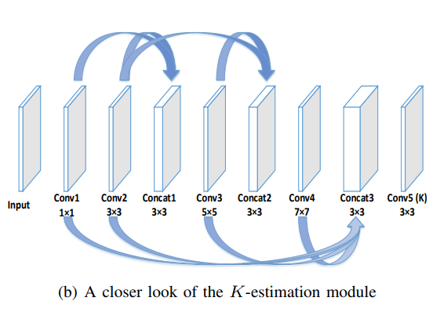

# AOD-Net.pytorch
Implement of [An All-in-One Network for Dehazing and Beyond" in pytorch](https://arxiv.org/abs/1707.06543)

</img>

## Datasets

[NYU2 Depth Database] (https://cs.nyu.edu/~silberman/datasets/nyu_depth_v2.html) was used to 
generated synthesized hazy images.

## Train

## Test

## Result
